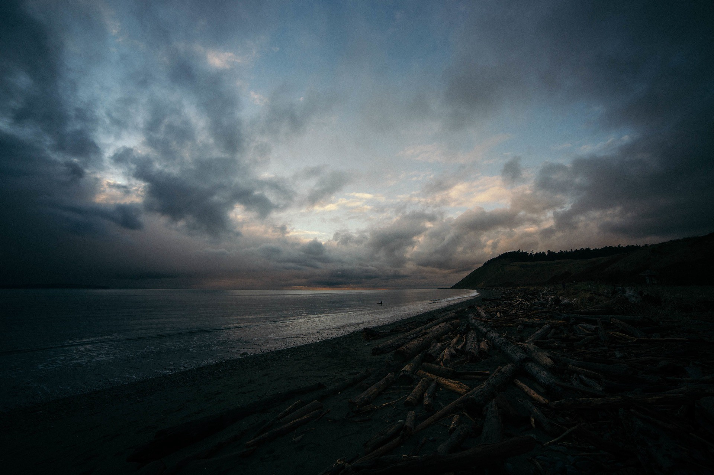

# A Lady by the Bay of Bengal

### @ Lakshmi Resorts, ECR

It’s been a good 10 years since I had a very good time with my family. The last time I came here was in 2005 along with my grandmother, aunts, uncles and cousins. We went to VGP Universal Kingdom, a couple of beaches and we finally spent the weekend at this resort in ECR. That was the last time we all saw our grandmother hale and healthy. She returned to our native after that trip, fell sick and eventually passed away.

My mother is one among her six children — three girls and three boys. All of them settled in every corner of the globe except my mother. My mom worked in our native and my grandma lived with her. Grandma lived her life contented without expecting any help from anyone. Till the last day of her life, she lived as she wanted to be.

The 2005 trip was the most memorable one because of two reasons. One, I was meeting my cousins after a long time. Eight cousins who are almost my age and a beach resort means absolute fun. Second, it is the beach. I have seen exotic beaches in Discovery and Nat Geo but always wanted to be near one.

10 years since then drifted by like 10 seconds and here I am, all grown up and with a good paying job in Chennai.

A couple of my friends and I decided to spend sometime in a resort in ECR. Chennai is again new to me (I just graduated from a college near the lush rain forests and Tiger Sanctuaries of Western Ghats). We decided to spend our weekend somewhere near the beach and have fun. After umpteen google searches, we landed on good old Lakshmi Resorts. Again, I was immediately up for it and that’s how we set about our short weekend trip.

### November 28, Morning…

The day has finally came. The resort manager called me to check if we would vacate the place by the next day evening as he wanted to rent the place for a movie shoot. We reached the place. It looked so different from the last time. Everything looked new to me except the good old banyan tree and the name of the place. The owner gave us the key and told us he will bring the food in couple of hours.

The resort has a swimming pool in the middle. We all dived in, stayed in the water for a couple of hours before realising the time was 2 P.M. We got out of water and all felt hungry. By the time, the food had arrived and We came to the dining hall after a good shower.

Lunch was done. I noticed one old maid coming to wash the dishes. She approached us and asked what she could do with the remaining food.

*“Paati, Neenga saapteengala?”* (Grandma, you had food??)

**“Ila thambi.”** (No son)

*“Apo neengalae saapdunga”* (Then you can eat it)

I retired to my room to have a quick nap and woke up at 5 to find my friends in sound sleep, not yet overcome the heaviness of a good meal. I thought now would be the best time to be alone at the beach. The old maid was standing outside smiling at me.

*“Paati, nalla saapteengala?”* (Grandma, did you have enough?)

***“Aama thambi”*** (Yes, son)

She asked me where I was going. I replied *“Beach”*. She requested if she can tag along. Ughh.. I didn’t want her to come but I couldn’t really say ***no*** to her face. The beach was after all 100 meters away and she could walk at her own will even if I had told her a ‘no’.

The beach was brilliant. The combination of fresh air, an approaching thunderstorm and the wet sand was pristine and refreshing to the mind.

She stayed a little behind me. I got lost in thoughts. The clouds looked so scary. It looked as if thunderstorm might come anytime. I didn’t care. I was busy ruminating the good old times I had had at the same place with my family. Something bothered me and I got out of my dreaminess. It’s this old lady.

**“Thambi, Puyal varum pola”** (Son, it looks as if storm is coming)

*“Aama paati”* (Yeah..) I said in a sigh…

The waves broke in and out, latching on my legs as they receded. The old lady didn’t want to be in the sea water. She was on the sands, not far away from me. I could hear her. I had my eyes fixed at the horizon.

**“Inga ithuku munnadi vanthurukeengala?”** (Have you ever come here before?)

I didn’t see her. I vaguely replied to her,

*“oru 10 varushathuku munnadi”* (Yeah, before 10 years)

**“Unga peru ena thambi?”** (Son, Whats your name?)

Now I got irritated. She’s slowly getting to know me and probably will ask me some money. I didn’t turn back at her and replied even harshly,

*“Christopher”*

I heard her giggle. I was wondering why this lady is laughing to hear my name. Is it funny? Did she understand my name at first? She let out a huge sigh.

**“En peru Gnanasoundhari”** (My name is *Gnanasoundhari.*)

*I heard this… in a voice very familiar to me.*

It took me a couple of seconds for my brain to process the voice I just heard.

*And the name… the name she just told. It’s my grandmother’s.*

I turned back.

**There was no one else at the beach. There was a storm coming behind me.**

P.S: “Thambi” means brother in Tamil. In some dialects of Tamil, people use it to respectfully refer to a person much younger to them. For better contextual understanding, I translated it as “Son”.

Originally published in Medium.