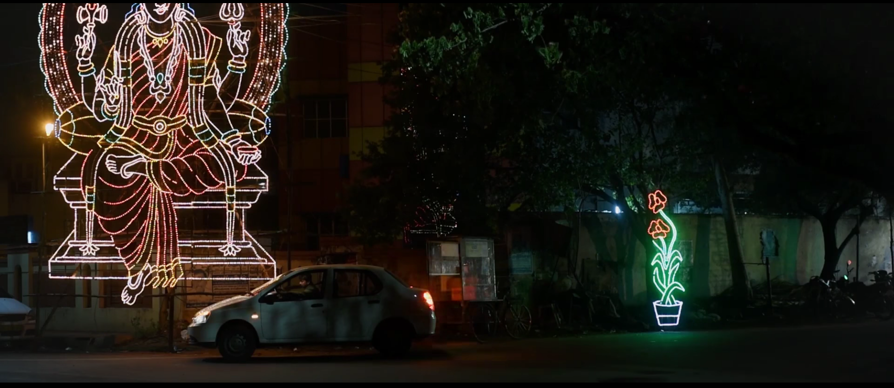

It was very late at night. Demonetisation had started taking toll on my family and myself. Every day, I had been making a few trips extra for those who pay me in cash. There are a couple of things in life you cannot do without cash.

My mother was recovering from severe cold and fever and the doctors did not understand the plight of an *Uber* driver. My life is a vicious cycle of payment wallets, customer ratings, number of rides, soaring fuel price, and now, bumping into effects of demonetisation at every turn of the road.

The clock ticked 10:55 PM. I had done 14 trips for the day against my usual 10 trips and had made a total of Rs. 1,800 of which 500 in cash. This cash would be enough for the next couple of days. Just as I was about to switch off the Partner app, Uber assigned me a ride nearby.

Mount Road, Chennai at 11.00 PM is usually empty. I put my foot down the accelerator and reached my pickup location, the Taj.

“*Hello Madam, Naan unga Uber partner pesuren. Enga varanum*?” (Hello Madam, I’m your Uber Partner speaking. Where should I come to pick you up?)

A girl responded.

“*Taj la Blend. Wait for 5 minutes, Anna*” (Blend Bar inside Taj. Wait for 5 minutes, brother) and the girl started to blurt something which I ignored.

I didn’t know what “Blend” is but I guessed it is a place within Taj. I waited in the parking for 10 more minutes.

Finally I saw someone waving goodbyes to a gang of people and trundled towards my car.

“*Anna, door open pannunga na*” (Brother, open the door please)

The girl was too drunk to even find where the door handle is. I came out to open the door for her. She is too hammered to even walk properly. She finally got inside the car and I was pretty sure she will pass out soon. I cursed myself for having to deal with someone who is drunk enough to forget real world. I got back to my driver seat.

“*Madam ride start pannata?*” (Madam, can I start the ride?).

The customary question I ask to every rider.

I was very happy that it was a cash ride.

I swiped right to start the trip right away.

“*mmmm*”, she managed to let out a faint yes.

I noticed her name from the Partner app.

The destination was somewhere near Sholinganallur. I was loath to travel all the way to a far off location while my mind and heart ached to go back home. I had turned on the navigation and accelerated my car through the near empty roads of Chennai.

A few minutes into the ride I heard what I knew would happen.

I stopped the car and parked it in a service lane. The stench of alcohol and of putrefied condiments she had consumed was unbearable. Probably because I wasn’t used to it. I figured there was little cleaning to be done. I thought to myself she drank way too much.

“*Sigh*…”

“*Anna thanni iruka?*” (Brother do you have some water?) I went to my seat to get her water. She gargled, spat twice and washed her face with the remaining water. She looked better than before. She seemed better.

I revved the engine and started cruising at 60 km/h at Gandhi Mandapam road.

“*Anna I’m sorry*”

I put up a facade of being calm although I was very much angry.

“*Paravailla Madam. Epdinalum car wash ku kudukanum*” (It’s okay Madam. Anyway, I have to give for Car wash) I gave her a dumb reason, like any customer-caring driver would do for the sake of better ratings.

She asked me how long I’ve been driving and wondered how empty are roads at 11:30 PM. I gave her blunt answers. Although her level of intoxication was slowly reducing, she kept mumbling something and I decided to ignore.

She remained silent for another 10 minutes. Her destination was nearing.

“*Ithu than na first time kudikrathu*” (This is the first time I drink)

She started again. She still seemed high. I thought I could give her my tad bit of advice.

“*Aanalum ivlo kudika koodathu. Konjam ah start pananum*” (You should start in small quantities if you are drinking the first time)

“*But friends only…… *(she was blabbering something).. *My last day with them…. Naan USA la padika poren nu poi soliten elarkitayum*” (I lied to my friends that I am going to USA for higher studies)

I usually do not get into personal discussion with customer but this one got me a bit curious. So I enquired.

“*Ithuku ethuku madam poi solanum? Unmaya sollalamae?*” (You could have very well told the truth. Right Madam?)

The car sped past Perungudi toll gate. There wasn’t any reply from her for another 10 minutes or so. Suddenly, I heard a mild sound like someone weeping. I wasn’t sure. Adjusting my center rear view mirror, I saw her eyes fixed at me with few drops on her cheeks.

We reached Sholinganallur junction and map showed her destination is just few streets away.

“*Anna, death pathi epovachu nenaipeengala?*” (Brother, do you think about death?)

Turning my head back to see her and with a puzzled look I said “*epovachu*” (sometimes).

That’s when she told me that.

“*Enaku cancer. Brain la. Chemo pandra level la thaandiruchu*” ( I have cancer in brain. It had gone past beyond levels to consider Chemo)

My heart started beating fast. I did not know what to say. I stopped in front of her house. She was searching for her purse to pay the bill.

“*Romba naal iruka maaten anna. Seekram poiduven. Inaiku than office ku last day. Friends farewell party kuduthanga. Avangaluku theriyathu enaku cancer-nu. abroad poren nu poi solliruken.*” ( I won’t be alive for long. I will die soon. Today is my last day at office and my friends gave me farewell party. They don’t know I have cancer. I lied to them I am going abroad. )

“….”

I sat there in the cab speechless. She continued,

“*Avangaluku theriyathu sorgam than abroad-nu*” (They don’t know that the ‘abroad’ is ‘heaven’)

She paid a generous 2000 bucks for the ride. I didn’t have the mind to say yes or no. She kept the money in the seat and left the car. I took a reverse to head towards Old-Mahabalipuram Road.

I turned off my phone and was cruising my way back home. Tears had started rolling down my cheeks.

**P.S:* ***“Based on true events” by a redditor and the actual Uber partner, [*westport76](https://www.reddit.com/r/AskReddit/comments/4r4a7r/uber_drivers_whats_the_deepest_secrets_youve/d4ykn2s/)*. Images used are for representational purpose. Please ignore 😜.

*Hope you like my attempt to narrate the story. Thanks for reading.*

Originally published in Medium.
